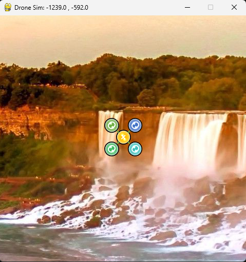
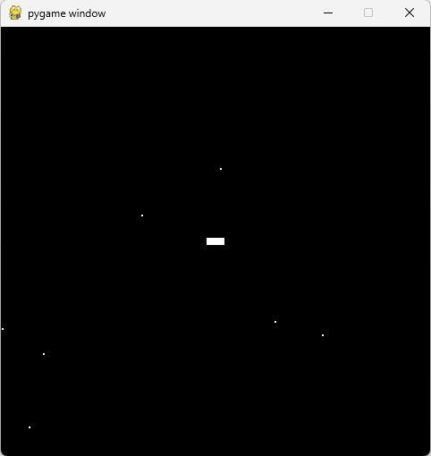

This is a simple game which simulates drone controls with gamepad. 

A. Environments:  
1. MS Windows 11  
2. Python 3.9.7  
3. Pygame 2.1.2 [Ref 1]  
4. Logitech Gamepad F310  

B. Features:
1. Drone flight control of yaw, throttle, roll and pitch with 4 channels (Axis 0-3)  
2. Speed gears and Rest controls with 2 channels (Axis 5-6)  
3. Overlay of drone Icons with background  
4. Easy replacement of background image, currently the Niagara Falls  
5. Background rotations when rolling left or right [Ref 3]   
6. Drone operations are based on the discriptions in [Ref 2]  
7. Simple program with about 150 lines of code in one file  

C. Game Controls:

1. Windows:
- Start: python DroneSim.py
- Exit: Close Game Window

2. Gamepad (Mode 2):  
- Axis 0: Yaw: Left, Right  
- Axis 1: Throttle: Up, Down  
- Axis 2: Roll: Left, Right  
- Axis 3: Pitch: Up, Down  
- Axis 4: Speed: +10%  
- Axis 5: Reset

D. Code and Data:  
- DroneSim.py  
- images/*  

E. Screenshot  
- Drone Sim:  

  

F. Added DroneSim2.py [Ref 4]  
- Draw (Circle)  
- Rect  
- Surface  
- Rotate  
- Scale  
- Joystick  

  

[Ref 1] https://www.pygame.org/    
[Ref 2] https://uavcoach.com/how-to-fly-a-quadcopter-guide/  
[Ref 3] https://stackoverflow.com/questions/4183208/how-do-i-rotate-an-image-around-its-center-using-pygame  
[Ref 4] https://github.com/Rabbid76/PyGameExamplesAndAnswers/blob/master/documentation/pygame_opengl/immediate_mode/pygame_opengl_immediate_mode.md#pygame-and-opengl-immediate-mode-legacy-opengl  

