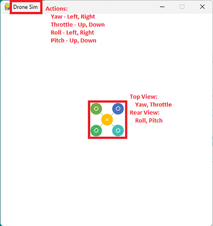

This is a simple game which simulates drone controls with gamepad.  
It uses Pygame to mimic 4 axis controls for yaw, throttle, roll and pitch.  

The biggest challenge is that pygame only supports 2D games, but it is  
required to control a drone with 4 axises and display the results.  
I use two 2D images, a top view and a rear view, of a drone icon to  
solve this issue.   

A. Environments:  
1. MS Windows 11  
2. Python 3.9.7  
3. Pygame 2.1.2 [Ref 1]  
4. Logitech Gamepad F310  

B. Game Controls:

1. Windows:
- Start: python dronesim.py
- Exit: ESC key

2. Gamepad (Mode 2):  
- Axis 0: Yaw: Left, Right  
- Axis 1: Throttle: Up, Down  
- Axis 2: Roll: Left, Right  
- Axis 3: Pitch: Up, Down  
- Axis 4: Speed: +10%  
- Axis 5: Reset

C. Screenshot and Video  
1. Start Page:  
  
2. Demo Video:  
https://user-images.githubusercontent.com/40175039/204050898-9efa083e-a28d-4c83-983d-b90b10778d09.mp4  

[Ref 1] https://www.pygame.org/    

